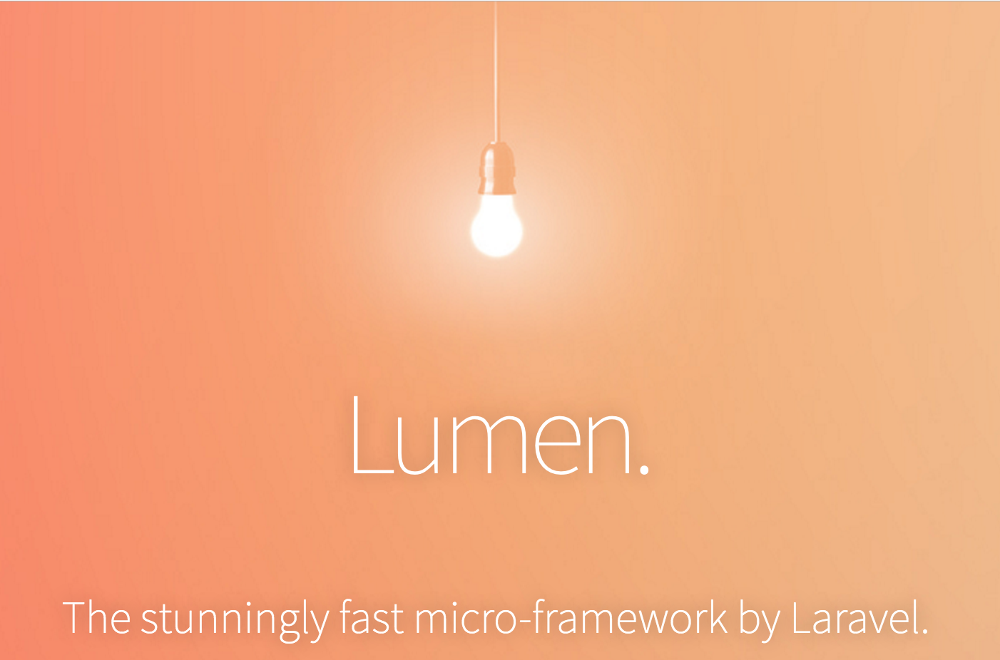

# Docker + Lumen with Nginx and MySQL



This setup is great for writing quick apps in PHP using Lumen from an any Docker client. It uses docker-compose to setup the application services.

## Clone this repo

```bash
git clone git@github.com:AngCosmin/docker-lumen-mysql.git lumen
cd lumen
```

### Configuration

To change configuration values, look in the `docker-compose.yml` file and change the `php` container's environment variables. These directly correlate to the Lumen environment variables.

### Build & Run

```bash
docker-compose up --build -d
```

`-d`: run as deamon (optional)

### Install packages

```bash
docker exec container-php composer install
```

Navigate to [http://localhost:80](http://localhost:80)

Success! You can now start developing your Lumen app on your host machine and you should see your changes on refresh! Classic PHP development cycle. A good place to start is `images/php/app/routes/web.php`.

Feel free to configure the default port 80 in `docker-compose.yml` to whatever you like.

### Stop Everything

```bash
docker-compose down
```

## If you want to create a fresh Lumen App

```bash
cd images/php
docker run --rm -it -v $(pwd):/app saada/lumen-cli lumen new app
```

To allow Lumen to use database navigate to `images/php/app/bootstrap` and open `app.php`. Uncomment these two line:  
```
$app->withFacades();

$app->withEloquent();
```

Done!

## Deploy to Heroku
Run `heroku login`

### Setup Lumen
1. Navigate to `images\php\app`
2. If you don't already have the file `Procfile` then create it and add this inside  
`web: vendor/bin/heroku-php-apache2 public/`
3. `git init`
4. `heroku create --region eu myapp`
5. `heroku config:set APP_KEY=SomethingRandom`  
6. `git add .`  
7. `git commit -m "First commit"`  
8. `git push heroku master`  

### Setup database
1. Go to https://data.heroku.com/
2. **Create Heroku Postgres** -> **Install Heroku Postgres**
3. Search for your app (myapp) created before press **Create**
4. Go to https://data.heroku.com/ and click your database
5. Go to **Setting** -> **View credentials** and set env variables for Lumen project like this:  
`heroku config:set DB_CONNECTION=pgsql DB_HOST=... DB_DATABASE=... DB_USERNAME=... DB_PASSWORD=... DB_PORT=...`
6. Open application `heroku open`

***Note:***  
To run artisan commands use `heroku run php artisan ...`.  
If you want debugger you can run `heroku config:set APP_DEBUG=true`

## Contribute

Submit a Pull Request!
